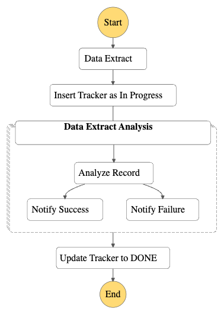

# experiment-step-functions

This is a personal SAM project that I have built to experiment with certain features of AWS Step Functions.

The State Machine is scheduled hourly using EventBridge.

1. A Lambda Function generates a JSON file, which is made out of a list of items, as if it fetches some periodic data from a database. It stores the file as a S3 object, and passes the object key to the next state. The Lambda function takes the state machine's execution start date/time as reference and passes this dateTime to the next state, too.
2. A DynamoDB table is used to track state machine progress. After data is exported to S3, a record is inserted into DynamoDB with the primary key as the execution start date time.
3. A Distributed Map State takes the JSON file as input and sends a message per each record to the SQS queue ( MaxItemsPerBatch = 1). The SQS message send state is asynchronous, the task token is appended to the state hence the state machine waits for the task success from an external process.
4. A Lambda function gets the message from the SQS queue and performs the unit of work. If the processing is successful, it sends TaskSuccess to the state machine. (If the retry attempts are exhausted, the message would be moved to DLQ, where a DLQ processor can send TaskFailed to the state machine. Otherwise, the state machine execution will continue to wait)
5. Once the Distributed Map execution is finished, the state machine updates the DynamoDB record's Status to DONE.

